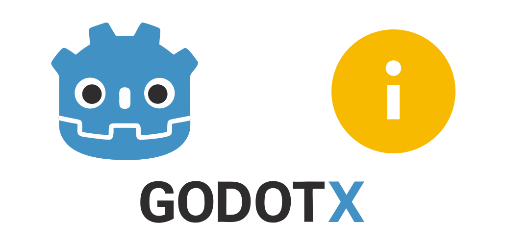
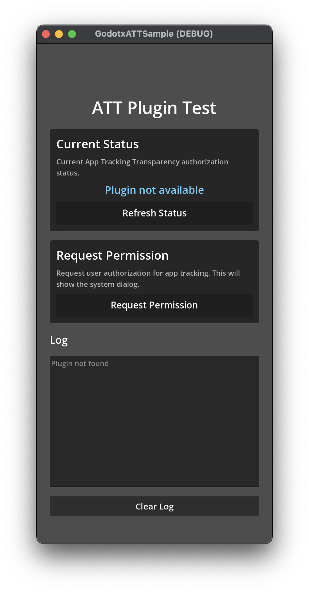

<p align="center">
    <a href="https://github.com/godot-x/att" target="_blank" rel="noopener noreferrer">
        
    </a>
</p>

# Godotx ATT

Native App Tracking Transparency (ATT) integration for Godot Engine.

## Table of Contents

- [Overview](#overview)
- [Quick Start](#quick-start)
- [Usage Examples](#usage-examples)
- [Building (For Developers)](#building-for-developers)
- [Project Structure](#project-structure)
- [API Reference](#api-reference)
- [FAQ](#faq)
- [Contributing](#contributing)
- [License](#license)

## Overview

This project provides a native App Tracking Transparency plugin for Godot, using Apple's ATTrackingManager API. The plugin is shipped as a native library for iOS (`.xcframework`).

Starting with iOS 14.5, apps must request user authorization to track them or access their device's advertising identifier (IDFA). This plugin provides a simple way to request and check the tracking authorization status.

### Key Features

- Request tracking authorization from the user
- Check current tracking authorization status
- Signal-based callback for authorization result
- Supports iOS 14.0+

### Version Information

| Component | Version |
|-----------|---------|
| Godot | 4.7-stable |
| Min iOS | 14.0 |

## Quick Start

### 1. Installation

#### Option A: Godot Asset Library (Recommended)

1. Open **AssetLib** in Godot Editor
2. Search for "Godotx ATT"
3. Click **Download** and **Install**

#### Option B: Manual Installation

1. **Download the ZIP** from [Releases](https://github.com/godot-x/att/releases)

2. **Extract the ZIP** - it contains 2 folders:
   ```
   godotx_att/
   ├── addons/
   └── ios/
   ```

3. **Copy both folders** to your Godot project root:
   ```
   your_project/
   ├── addons/
   │   └── godotx_att/
   └── ios/
       └── plugins/
           └── att/
   ```

4. **Enable the plugin** in Godot:
   - Open **Project → Project Settings → Plugins**
   - Enable "Godotx ATT"

### 2. Configure Export Preset

#### iOS

1. Open **Project → Export** and select your iOS preset
2. Enable **GodotxATT** in the plugins list
3. In **Application → Additional Plist Content**, add:

```xml
<key>NSUserTrackingUsageDescription</key><string>This identifier will be used to deliver personalized informations to you.</string>
```

> **Important:** The `NSUserTrackingUsageDescription` is required. Without it, the app will crash when requesting tracking permission. Customize the message to explain why your app needs tracking.

## Usage Examples

### Basic Usage

```gdscript
extends Node

var att

func _ready():
    if Engine.has_singleton("GodotxATT"):
        att = Engine.get_singleton("GodotxATT")
        att.permission_result.connect(_on_permission_result)

        # check current status
        var status = att.get_status_string()
        print("Current ATT status: ", status)

func request_tracking():
    if att:
        att.request_permission()

func _on_permission_result(data):
    print("ATT Result: ", data)
    # data = { "status": 3, "status_string": "authorized" }
```

### Using ATTStatus Class

The plugin includes a helper class `ATTStatus` with constants and utility methods:

```gdscript
func _on_permission_result(data):
    var status: int = data.get("status", -1)

    if status == ATTStatus.AUTHORIZED:
        print("Tracking authorized!")
        # initialize your analytics SDK
    elif status == ATTStatus.DENIED:
        print("Tracking denied")
    elif status == ATTStatus.RESTRICTED:
        print("Tracking restricted by system")
    elif status == ATTStatus.NOT_DETERMINED:
        print("Status not determined")

    # helper method
    if ATTStatus.is_trackable(status):
        print("Can track user")
```

### Check Status Before Requesting

```gdscript
func check_and_request():
    if att == null:
        return

    var status = att.get_status()

    match status:
        ATTStatus.NOT_DETERMINED:
            att.request_permission()
        ATTStatus.RESTRICTED:
            print("Tracking restricted by system")
        ATTStatus.DENIED:
            print("User denied tracking")
        ATTStatus.AUTHORIZED:
            print("Tracking authorized")
```

### Status Values

| Value | String | Description |
|-------|--------|-------------|
| 0 | `not_determined` | User has not been asked yet |
| 1 | `restricted` | Tracking restricted (parental controls, MDM) |
| 2 | `denied` | User denied tracking permission |
| 3 | `authorized` | User authorized tracking |

## Building (For Developers)

### Prerequisites

- macOS with Xcode installed
- [XcodeGen](https://github.com/yonaskolb/XcodeGen) (`brew install xcodegen`)
- [SCons](https://scons.org/) for building Godot headers

### Build Commands

```bash
make setup-godot         # Clone Godot source
make build-godot-headers # Generate iOS headers
make setup-apple         # Generate Xcode project
make build-apple         # Build iOS plugin
make package             # Create distribution ZIP
make clean               # Clean build artifacts
```

## Project Structure

```
att/
├── addons/godotx_att/       # Godot plugin
│   ├── att_status.gd        # Status constants class
│   ├── export_plugin.gd
│   └── plugin.cfg
│
├── source/                  # Native source
│   └── ios/att/
│       ├── Sources/
│       │   ├── godotx_att.h
│       │   ├── godotx_att.mm
│       │   ├── godotx_att_module.h
│       │   └── godotx_att_module.cpp
│       ├── project.yml
│       └── att.gdip
│
├── ios/plugins/             # Built output (.xcframework)
├── scenes/Main.tscn         # Test scene
└── scripts/Main.gd          # Test script
```

## API Reference

### Methods

| Method | Return | Description |
|--------|--------|-------------|
| `request_permission()` | `void` | Shows the system tracking authorization dialog |
| `get_status()` | `int` | Returns current authorization status (0-3) |
| `get_status_string()` | `String` | Returns status as string |

### Signals

| Signal | Args | Description |
|--------|------|-------------|
| `permission_result` | `data: Dictionary` | Emitted when user responds to authorization request |

### Signal Data Format

```gdscript
{
    "status": int,        # 0-3
    "status_string": String  # "not_determined", "restricted", "denied", "authorized"
}
```

### ATTStatus Class

Helper class for status comparison and utilities.

**Constants:**

| Constant | Value | Description |
|----------|-------|-------------|
| `ATTStatus.NOT_DETERMINED` | 0 | User has not been asked yet |
| `ATTStatus.RESTRICTED` | 1 | Tracking restricted by system |
| `ATTStatus.DENIED` | 2 | User denied tracking |
| `ATTStatus.AUTHORIZED` | 3 | User authorized tracking |

**Static Methods:**

| Method | Return | Description |
|--------|--------|-------------|
| `ATTStatus.status_to_string(status: int)` | `String` | Converts status code to string |
| `ATTStatus.is_trackable(status: int)` | `bool` | Returns `true` if status is `AUTHORIZED` |

## FAQ

**Q: Does this work on Android?**
No. App Tracking Transparency is an iOS-only feature. On Android, use the Advertising ID directly.

**Q: What iOS version is required?**
iOS 14.0+. On iOS versions below 14.0, the plugin returns `authorized` status as tracking was allowed by default.

**Q: When should I request permission?**
Request permission at an appropriate moment in your app flow, not immediately on launch. Apple recommends explaining why you need tracking before showing the dialog.

**Q: Can I customize the dialog message?**
Yes, customize the message via `NSUserTrackingUsageDescription` in your Info.plist.

## Contributing

Contributions are welcome! Here's how you can help:

1. **Report bugs**: Open an issue with reproduction steps
2. **Request features**: Suggest new features or improvements
3. **Submit PRs**:
   - Follow existing code style
   - Test on iOS device/simulator
   - Update documentation as needed

### Project Conventions

- **iOS**: Objective-C++ for Godot integration
- **Naming**: `GodotxATT` for singleton name
- **Signals**: Use snake_case (e.g., `permission_result`)
- **Methods**: Use snake_case following GDScript conventions

## Screenshot



## License

MIT License - See [LICENSE](LICENSE)

## Support

- **Issues**: [GitHub Issues](https://github.com/godot-x/att/issues)
- **Discussions**: [GitHub Discussions](https://github.com/godot-x/att/discussions)

Made with love by [Paulo Coutinho](https://github.com/paulocoutinhox)
